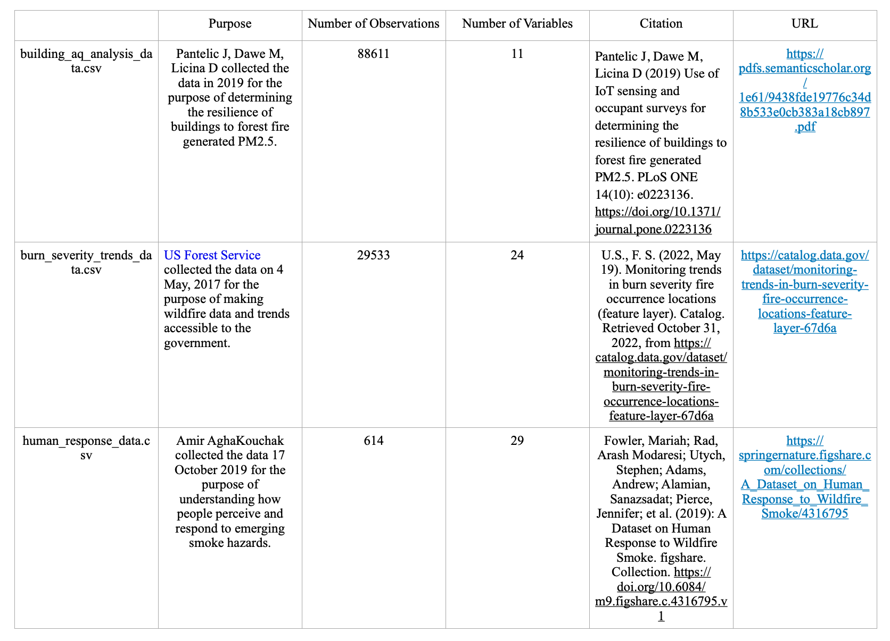

# Integrating Wildfire Protection: Project Proposal

## Code Name: Smoky Shelters

## Authors

Lilli Toone; tlilli@uw.edu  
Patricia Ma; aidim@uw.edu  
Rachel He; rachelxw@uw.edu

## Affiliation

INFO-201: Technical Foundations of Informatics - The Information School - University of Washington

## Date

Autumn 2022

## Abstract

In this project, we aim to thoroughly examine datasets on wildfire’s negative impact on participants’ physical health and the correlation between their health condition and personal cautiousness with the declining air quality. We will educate ourselves by analyzing three datasets and providing an in-depth report on our research questions regarding wildfire and physical well being.

## Key Words

Wildfire, community development, air quality, building safety

## Introduction

As climate change continues to affect our ecosystems, the rate and intensity of annual wildfires have increased in the Pacific Northwest ([EPA, 2021](https://www.epa.gov/climate-indicators/climate-change-indicators-wildfires)). With this increase comes a threat to public health, as people have no choice but to breathe in smoke particles. We are concerned with how these community members currently protect themselves from hazardous health conditions caused by wildfires. Answering this question can not only suggest to urban planners methods to keep their residents safe, but it can also encourage these residents to be more conscious of the negative effects of wildfires. We hope to provide an in-depth analysis of the safest places to stay during wildfire season. We will address this concern by examining three data sets on recent trends of wildfire intensities, how college students perceive and navigate poor air quality from smoke, and the safest locations within buildings during wildfire seasons.

## Problem Domain

**Background:** Wildfires emit carbon dioxide and other greenhouse gasses that will continue to warm the planet well into the future. They damage forests that would otherwise remove CO2 from the air. They also emit soot and other aerosols into the atmosphere, with complex effects on global warming and cooling ([Berwyn, 2020](https://insideclimatenews.org/news/23082018/extreme-wildfires-climate-change-global-warming-air-pollution-fire-management-black-carbon-co2/)). The increased air pollution can cause a range of health issues such as respiratory problems. Even in healthy people, exposures to fine particles can potentially lead to transient reductions in lung function, and pulmonary inflammation.([EPA, 2021](https://www.epa.gov/wildfire-smoke-course/health-effects-attributed-wildfire-smoke)).

**Relevance:** Wildfires and volcanic activities affected 6.2 million people between 1998-2017 with 2400 attributable deaths worldwide from suffocation, injuries, and burns ([WHO, 2018](https://www.who.int/health-topics/wildfires#tab=tab_1)), but the size and frequency of wildfires are increasing due to climate change.

**Human values:** We value accessibility and inclusivity. Although there may be protective facilities regarding wildfire smoke, those may not be available to people with differing abilities. We examine data beyond the PMI levels of rooms by using results from surveys. We believe that health resources should be available to everyone, and we take into account how people define accessibility and inclusiveness of healthy spaces.

**Indirect Stakeholders:** Policy makers are indirect stakeholders since they can get access to recent development of wildfires and people’s responses about it. If community members are passionate and share our concern of wildfire threat, policy makers may respond to that by using our data analysis as evidence. If people take wildfires less seriously than researchers, for example, policymakers can also take action to increase awareness through advocacy efforts. Additionally, student advocacy groups are indirect stakeholders because they may use our report as a starting point to poll university members on their wildfire concerns.  

**Direct Stakeholders:** Our project team is one of the direct stakeholders as our project success depends on our decisions and contributions. The researchers who collected the data we are using are also stakeholders because their work is being used to produce a report that could impact others.

**Potential Benefits and Harms:** The potential benefits of our project is to provide motivations and inspirations for engineers and architects to construct safer buildings in areas prone to wildfires. The potential harm is that the analysis might induce anxiety in some readers because natural disasters like wildfires are uncontrollable events which happen annually, and corresponding building reconstructions require substantial capital investment and design dedication.

## Research Questions

1. Does the general health of a survey participant affect their consciousness of the negative health effects of wildfires? This is a question to expose possible disparities between the health concerns of a generally healthy individual versus a generally unhealthy individual. Knowledge of this encourages building planners to consider the accessibility of the shelters available.
2. Does the geographic location of a survey participant affect their perception of wildfires? This question explores how an individual’s analysis of perceived danger correlates to their daily surroundings. Data analysts must be aware that a survey respondent answers in the context of their daily life, so answers are affected by intersectionality.
3. Which rooms do people imagine to be the safest during an increase in air pollutants due to wildfire smoke? This question is crucial to understanding possible reasons for taking shelter in certain areas, and this more clearly defines the meaning of safety as the mix between emotional and physical safety.
4. Which rooms have the best measured air quality during an increase in wildfire smoke? This question allows for a comparison between perceived safety and scientific safety, as measured by the amount of pollutants in the air. Building planners can use this data to create spaces that both protect against pollutants and are an inviting environment.

## The Data Set

* Our first data set came from 3 researchers Jovan Pantelic, Megan Dawe , and Dusan Licina from UC Berkeley in 2019 which contains air quality data measured in pm2.5 in specific buildings and rooms in a particular state, documented throughout different times of the day. This data set came from their examination of building’s resilience to wildfires and associated emissions of particulate matter indoors. It will be primarily used to answer our third and fourth research questions about people’s indoor activities during wildfires and how the building structure actually protests the individuals. https://pdfs.semanticscholar.org/1e61/9438fde19776c34d8b533e0cb383a18cb897.pdf

* Our second data file came from the US Forest Service published in May 2022 which contains documented wildfires since 1984 in different states and their damage measured in acres. This data serves as the fundamental learning tool for us to understand wildfires recurrency and severity. It will also help us resolve our second research question while studying the correlation between participants geographic location and their perception of wildfires. https://catalog.data.gov/dataset/monitoring-trends-in-burn-severity-fire-occurrence-locations-feature-layer-67d6a

* Our third file contains survey results that record behavior in response to the 2018 summer California wildfires. It would answer the first research question by comparing the consciousness level of people who have different physical health conditions and any other factors that would affect individuals’ response.
https://springernature.figshare.com/collections/A_Dataset_on_Human_Response_to_Wildfire_Smoke/4316795

## Expected Implications

* Architects and building planners will reference our analysis to construct buildings with designated spaces that limit smoke. They will recognize that these spaces should also be accessible to people of lower general health. Additional experiments with new building materials and structures may be considered.

* Governors will use our analysis to understand the general public’s cautiousness of wildfires' negative impacts on their physical health and how well the civilians are protected indoors during wildfire seasons. They will set up education and protective protocols to help citizens protect themselves, and budget fundings for infrastructure amelioration.

* Other researchers in communities prone to wildfires, such as the Pacific Northwest, will begin to conduct their own surveys and experiments to test how local residents feel about the threats of wildfires. Policymakers may use their published work to establish possible regulations on building safety.

## Limitations

Our data set surveys students in college, so our data analysis is not representative of the general public such as the elderly, children, and those in poverty. This narrows the scope of our study and reduces applicability to other urban buildings. Additionally, the building air quality data and the survey data we will use are based on university campuses in California, so our findings may only be applicable to a culture, environment, and buildings similar to those of California and its annual wildfires. We may address these limitations by adjusting our research question to also question community safety in California. However, this adjustment excludes possible implications for the increasing wildfires in the Pacific Northwest such as Washington, Idaho, and Southwestern Canada. By including implications for the Pacific Northwest, we hope to encourage the development of data sets that also contain survey results and building safety in locations outside of California.

## Acknowledgements

Raina Scherer, for providing resources to finding a credible and extensive data set.

## References

Berwyn, B. (2020, December 7). How wildfires can affect climate change (and vice versa). Inside Climate News. Retrieved October 31, 2022, from https://insideclimatenews.org/news/23082018/extreme-wildfires-climate-change-global-warming-air-pollution-fire-management-black-carbon-co2/

Environmental Protection Agency. (2021, August 1). Climate Change Indicators: Wildfires. EPA. Retrieved October 31, 2022, from https://www.epa.gov/climate-indicators/climate-change-indicators-wildfires

Environmental Protection Agency. (2021, November 17). EPA. Retrieved October 31, 2022, from https://www.epa.gov/wildfire-smoke-course/health-effects-attributed-wildfire-smoke

Organization, W. H. (2018). Wildfires. Retrieved October 31, 2022, from https://www.who.int/health-topics/wildfires#tab=tab_1

## Appendix A: Questions
